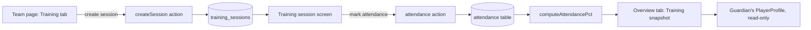
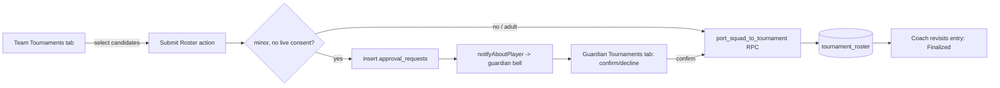
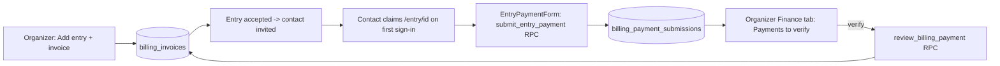
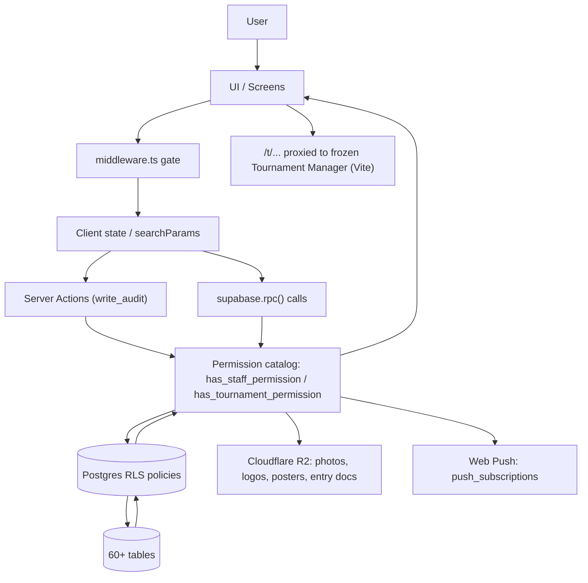

# Current Architecture — Dulà HQ (dula-hq-2.0)

_Reverse-engineered from the live repository on 2026-09-28/29 by three parallel
read-only research passes (screens/routes, server actions/RPCs, docs/migration
history). This is a snapshot, not a design doc — re-verify anything load-bearing
before acting on it, the same rule CLAUDE.md applies to itself. Companion file:
[LEGACY_CANDIDATES.md](LEGACY_CANDIDATES.md)._

Scope: `dula-hq-2.0` only (the actively-developed Next.js app). The sibling
`DulaHQ` repo (frozen single-file Vite tournament engine, proxied at `/t/...`
per CLAUDE.md §8) was deliberately excluded from this pass.

---

## 1. System overview

Dulà HQ is a multi-tenant club/tournament management SaaS on Next.js 15 (App
Router) + Supabase Postgres (one shared project, `zytyakbgwaegvftblkcn`), with
five distinct "consoles" sharing one permission catalog and one auth session:

| Console | Root route | Audience |
|---|---|---|
| Public directory | `/`, `/clubs`, `/tournaments` | Guests, unauthenticated |
| Club console | `/c/[clubSlug]/...` | Club staff (7 roles) |
| Tournament organizer console | `/tm/[orgSlug]/[tournamentSlug]/...` | Tournament staff (9→7 roles, §0u) |
| Guardian / Player self-service | `/guardian`, `/player` | Families, minimal by design |
| Platform admin console | `/platformconsole` | Platform Admin only |
| Entrant portal | `/entry/[entryId]` | External team contacts, no org membership |

A sixth, older surface — the Tournament Manager engine itself (brackets,
groups, live scores) — is a separate frozen app, reached via `/t/...`
(Vercel rewrite to `dula-hq.vercel.app`, excluded from this app's own
middleware matcher).

## 2. Major screens

Full inventory (24 routes + their tab-level sub-screens), built by tracing
real `Link`/`router.push`/RPC-driven navigation, not assumed from file names:

| Screen ID | Route | Purpose | Entry Points | Exit/Next | APIs/Services | Status |
|---|---|---|---|---|---|---|
| HOME | `/` | Public landing / org home | Nav brand, login redirects | `/clubs`,`/tournaments`,`/demo`,`/entry/[id]`,`/tm/...`,`/c/[slug]` | `my_manageable_tournaments`, `my_entrant_entries` | ACTIVE |
| CLUBS_DIR | `/clubs` | Guest directory / "my clubs" | Home tile, public path | `/clubs/new`, `/c/[slug]`, `/platformconsole` | `loadPublicClubs`, `getClubCreatableOrgs` | ACTIVE |
| CLUBS_NEW | `/clubs/new` | Create-club form | "New club" button | `redirect(/c/[slug])` | insert `clubs` | ACTIVE |
| TOURNAMENTS_DIR | `/tournaments` | Public tournament directory + managed list | Home tile, public path | `/tm/...`, `/t/...` (proxied) | `loadPublicTournaments`, `my_manageable_tournaments` | ACTIVE |
| DEMO | `/demo` | One-click sign-in as any of 9 seeded personas | Home "Try it as any role" | Each persona's own home | `signInWithPassword` (seeded accounts) | ACTIVE, depends on seed scripts |
| LOGIN | `/login` | Sign-in, redirectTo-aware destination messaging (§0z) | middleware redirect, guardian-signup link | wherever `redirectTo` points | Supabase auth | ACTIVE |
| GUARDIAN_SIGNUP | `/guardian-signup` | Self-serve guardian account creation | Login page link | `/` → auto-routed to `/guardian` | `auth.signUp` | ACTIVE |
| CHANGE_PW | `/change-password` | Forced temp-password change | middleware hard-redirect | `/` | `changeTemporaryPassword` | ACTIVE, forced not linked |
| CLUB_CONSOLE | `/c/[clubSlug]` | Club console, 9 tabs | Club lists, ActionCenter, demo | `/c/[slug]/teams/...`, `/drills`, `/it`, `/support`, `/trips/...` | many, `has_staff_permission` | ACTIVE |
| CLUB_DRILLS | `/c/[clubSlug]/drills` | Drill library CRUD | Club console button | back to club console | `drills` CRUD | ACTIVE |
| CLUB_IT | `/c/[clubSlug]/it` | IT console: view-as, suspend/reactivate, audit, logins, listing | Club console button (gated) | back to club console | `it_club_directory`, `start_impersonation`, `set_staff_account_status` | ACTIVE |
| CLUB_SUPPORT | `/c/[clubSlug]/support` | Escalation tickets to Platform Admin | Club console button (gated) | back to club console; ticket also in `/platformconsole?tab=support` | `submit_support_request`, `support_requests` | ACTIVE |
| TEAM_PAGE | `/c/[clubSlug]/teams/[teamSlug]` | Team workspace: Roster/Training/Tournaments | ActionCenter, club Teams tab | `/players/[id]`, `/training/[id]`, `/tournaments/[id]` | `getClubAccess`, `getAssignedTeamIds` | ACTIVE |
| PLAYER_DETAIL (coach) | `.../players/[playerId]` | Canonical Player Profile, coach viewer | Team roster "Open full profile" | back to team page | `has_staff_permission` (13 keys) | ACTIVE — the one shared `PlayerProfile.tsx`, confirmed no duplicate renderers remain |
| TRAINING_SESSION | `.../training/[sessionId]` | Attendance + attached drills | Session list row, ActionCenter action item | back to team page | `attendance`, `session_drills` | ACTIVE |
| TEAM_TOURNAMENT_ENTRY | `.../tournaments/[entryId]` | Build/submit tournament roster | Tournaments tab row | back to team page | `port_squad_to_tournament`, `approval_requests` | ACTIVE |
| TRIP_DETAIL | `/c/[clubSlug]/trips/[tripId]` | Passenger list + transport legs | Club Trips tab row | back to club console | trip/passenger tables | ACTIVE |
| GUARDIAN_HOME | `/guardian` | Guardian self-service (per child) | Nav chip, `personaLanding()` redirect, demo, notifications | terminal | `PlayerProfile` (viewer=guardian), `decideAcknowledgement` | ACTIVE, deliberately minimal-entry |
| PLAYER_HOME | `/player` | Player self-service | Same pattern as guardian | terminal | `PlayerProfile` (viewer=player) | ACTIVE, deliberately minimal-entry |
| ENTRY_PORTAL | `/entry/[entryId]` | External team-contact portal | Home "Your team entries" | terminal | `entrant_entry_portal`, `submit_entry_payment` | ACTIVE |
| TM_CONSOLE | `/tm/[orgSlug]/[tournamentSlug]` | Organizer console, 8 permission-gated tabs | Home/`/tournaments` "you manage" lists, demo | `/t/...` (engine, proxied) | `has_tournament_permission` (16 keys) | ACTIVE |
| PLATFORM_CONSOLE | `/platformconsole` | Directory/provision/support/billing/troubleshoot/listings/logins | Clubs page button, demo | terminal | many | ACTIVE, not public |

Tab-level sub-screens (all confirmed ACTIVE, each gated by its own permission
check rather than being a dead placeholder):

- **ClubPageTabs**: Overview, Teams, Staff, Finances\*, Reports\*, Meetings,
  Trips, Announcements, Photos (\*conditional on permission).
- **TeamRosterTabs**: Roster, Training, Tournaments.
- **PlayerProfile** (shared by coach/player/guardian routes): Overview,
  Development (Goals/Evaluations/Notes/Timeline), Fees, Membership,
  Documents, Family, plus caller-supplied extra tabs (Announcements, and for
  guardians a Tournaments/Billing wrapper).
- **TournamentTabs**: Entries, Categories, Finance\*, Announcements\*,
  Documents\*, Officials\*, Staff\*, Public listing\*.
- **PlatformConsolePage**: directory / provision / support / billing /
  troubleshoot / listings / logins (query-param tab switch).

**No orphaned page was found** — every route has at least one concrete
navigation entry point, or is a deliberate forced-redirect target
(`/change-password`), or a deliberately guest-facing public landing page.

**Confirmed retired, cleanly (not left as dead code):**
`ClubDashboardStats.tsx` (folded into `Reports.tsx`'s "Club-wide" section,
§0k), the three independent pre-consolidation player-detail renderers
(replaced by the one shared `PlayerProfile.tsx`, §0c Phase 1), the four
dead demo-account login buttons on `/login` (§6.C), and the
`logistics`/`volunteer_coordinator` tournament roles (§0u) — all verified
gone from the current file tree, not just claimed gone in CLAUDE.md.

## 3. Major user journeys

**Coach runs a training session → guardian sees attendance:**

**Coach submits a tournament roster → guardian consent → port:**

**External team contact pays a tournament entry fee:**

**Platform Admin troubleshoots a user's access:**

```mermaid
flowchart LR
  A[/platformconsole Troubleshoot tab/] -->|pick org| B[org_people_directory RPC]
  B --> C[pick a person, enter reason]
  C --> D[start_platform_impersonation RPC]
  D --> E[effective_access_for_platform RPC]
  E --> F[Readout: role + permission bundle]
  F -->|end session| G[end_platform_impersonation RPC]
  G --> H[audit_log: attributed to admin, never the target]
```

## 4. Navigation architecture

`src/middleware.ts` is the single root-level gate: every path not in
`PUBLIC_PATHS` (`/login`, `/guardian-signup`, `/demo`, `/`, `/tournaments`,
`/clubs`, and single-segment `/c/[slug]`) requires a signed-in user, or is
redirected to `/login?redirectTo=<path>`. `/clubs/new` deliberately shares
the `/clubs` prefix but is **not** public — it has its own guard. `/t/...`
is excluded from the matcher entirely (rewritten to the proxied engine
before this app's auth ever runs). A second gate forces
`must_change_password` accounts to `/change-password` regardless of where
they were headed.

`/guardian` and `/player` are intentionally near-orphan pages by the app's
own design comment (`src/lib/persona-landing.ts`): nothing links to them
except a nav chip (shown only if the signed-in user actually has that
persona), an auto-redirect for org-less accounts (`personaLanding()`), the
`/demo` buttons, and notification links. This is documented as deliberate,
not a bug.

## 5. Business processes — the permission catalog

Two independent catalogs, same shape, deliberately not unified (§0l):
`has_staff_permission(key, club_id, team_id?)` for club/team context, and
`has_tournament_permission(key, tournament_id)` for tournament context.
Club-scope keys bypass the team fence; a real scope-leak bug from a shared
role string (`treasurer` existing in both catalogs) was found and fixed
(`phase8b1`, §0l). A third, wider tier — `platform_impersonation_*` — spans
both entitlements for Platform Admin troubleshooting only (§0m), additive to,
not a replacement for, the club- and tournament-scoped "view as" features.

Two sources of org-admin truth still coexist, by design but worth knowing:
the legacy `org_members` table and the (still-empty-in-practice)
`role_assignments` table (`src/lib/supabase/server.ts`) — CLAUDE.md §0d
calls this out as a deliberate incremental migration, not yet completed.

## 6. API / service architecture

- **Server actions** (`'use server'` files under `src/app/**/actions.ts` and
  similar) call `write_audit(...)` — the checked variant, requiring
  `is_user_in_org` or Platform Admin (§0p).
- **SECURITY DEFINER SQL functions** authored after the phase11a split call
  `write_audit_system(...)` — unchecked, `service_role`-only, meant to be
  called only from inside another definer function. Confirmed consistent
  across all 14 current server-action call sites and every post-phase11a
  migration checked.
- **Every new SECURITY DEFINER function must revoke `EXECUTE` from
  `public`/`anon`** — `EXECUTE` defaults to PUBLIC on creation, which
  regressed the anon-executable-function count twice in this project's
  history (§0g). A regression test (`anon_executable_secdef_count() = 0`,
  with one named, tracked allowlist exception — `entry_login_background`,
  §0x) now guards this in `tests/rls`.
- **RLS filters, it doesn't raise**, on an UPDATE/DELETE that matches no row
  the caller is authorized for — a refused write looks identical to a
  successful no-op unless the caller checks the affected row count. This
  has caused at least two real bugs in this project's history (§0i, §0y)
  and is a standing trap for new mutations.

## 7. Data flow

## 8. External integrations

- **Supabase** (Postgres 17, `zytyakbgwaegvftblkcn`) — the only database,
  shared with the frozen `DulaHQ` app.
- **Cloudflare R2** — club/staff photos, club/org logos, tournament posters,
  tournament entry documents. Club-side player documents are still inline
  base64 in Postgres, not R2 (a known inconsistency, not yet unified).
- **Web Push** (`web-push` + VAPID keys) — best-effort push, always backed
  by a durable `notifications` row regardless of push success.
- **Vercel rewrites** — `/t/...` and formerly `/platformconsole` proxied to
  `dula-hq.vercel.app` (the frozen Tournament Manager engine); the platform
  console proxy was retired once this app grew its own.
- **pg_cron** — `expire_stale_approvals()` (hourly), `expire_temp_logins()`
  (hourly). No other scheduled jobs found.
- **No email provider is wired at all** (`docs/proposals/email-and-invitations.md`,
  confirmed still true — zero references to any SMTP/email library anywhere
  in `src/`). Guardian invites, staff invites, and password resets are all
  either in-app-only or IT-provisioned-login workarounds until this exists.

## 9. Important dependencies

- The five consoles all depend on the same two permission-resolver
  functions; a bug in either has the widest possible blast radius in this
  app (see `has_tournament_permission`'s scope-leak fix, §0l, as a real
  precedent).
- `PlayerProfile.tsx` is a single point of dependency for three routes
  (coach, guardian, player views) — a change there is a three-screen change.
- The entrant portal and tournament billing both depend on
  `tournament_entry_contacts`' self-claim-by-email mechanism, which has no
  token and relies entirely on RLS matching the signed-in email — the same
  interim pattern the guardian-invite flow already uses (§0l notes this is
  a known, deliberate, unresolved simplification).

## 10. Known architectural inconsistencies

1. **Duplicate attendance-percentage formula.** `src/lib/attendance-stats.ts`'s
   `computeAttendancePct()` was extracted specifically to kill three
   independent copies (§0k) — but `PlayerProfile.tsx`'s Overview tab has a
   fourth, hand-written copy of the identical formula, not calling the
   shared helper. See LEGACY_CANDIDATES.md.
2. **Club documents are inline base64; every other document/media type in
   this app (photos, logos, posters, tournament entry docs) is on R2.** Not
   wrong, just inconsistent — flagged, not a bug.
3. **`phase8b1` is used as a migration name twice** for two unrelated
   migrations (`phase8b1_widen_role_permission_defaults_check` and
   `phase8b1_fix_has_tournament_permission_scope_leak`) — a naming
   collision in the migrations directory, cosmetic unless tooling ever
   sorts/keys on the phase tag alone.
4. **CLAUDE.md's prose references a `phase12d1` migration that has no
   corresponding file** in `supabase/migrations/` — everything attributed to
   it in prose is inside `phase12d`'s own file. Either a squash happened, or
   a file was never committed; worth checking the live project's
   `schema_migrations` table if the distinction ever matters.
5. **10 pre-consolidation "Club Manager" migrations (the earliest files in
   the directory, predating the 2026-09-07 identity rework) are not
   narrated anywhere in CLAUDE.md** — genuinely undocumented history, not
   dead code (the schema they created is still live, layered over by every
   later phase).

## 11. Known legacy candidates

See [LEGACY_CANDIDATES.md](LEGACY_CANDIDATES.md) for the full classified
list with evidence, blast radius, and a proposed (not yet applied) cleanup
sequence. Headline items: two orphaned server actions, one already-known
dead SQL function plus three newly-found orphaned ones (including a whole
unused billing usage-metering sub-feature), two intentionally-kept
`DEPRECATED` database columns, and the attendance-formula duplicate above.

## 12. Unknowns requiring runtime verification

- **Whether the live database's pre-phase11a SECURITY DEFINER functions
  were actually repointed from `write_audit` to `write_audit_system`.**
  The phase11a/a1/a2 migration files only redefine the two audit functions
  themselves; the commit message describes a mechanical rewrite of 17
  internal callers via `pg_get_functiondef`, but no migration file contains
  those 17 rewritten bodies. Static analysis of the repo cannot confirm the
  live state — check `pg_get_functiondef` on the live project for one or
  two of those 17 (e.g. `port_squad_to_tournament`, `transfer_player_to_team`)
  to confirm they call `write_audit_system`, not the checked `write_audit`,
  internally.
- **Whether `platform_audit_log()` is genuinely dead or just not yet
  wired to a screen.** It's real, granted, and matches what CLAUDE.md §0m
  claims was built — but no UI calls it. Check with the person who owns the
  Troubleshoot tab whether this was meant to ship and got missed, or was
  deliberately deferred and the doc overstated it.
- **Whether the billing usage-metering trio
  (`record_billing_usage_event`/`snapshot_billing_usage_period`/
  `project_billing_amount`) is planned future work from the external
  "arenaai" commit, or truly dead weight.** No producer, no consumer, no
  scheduler exists for any of the three — but they arrived as part of a
  larger externally-authored billing domain (§0m) that this project only
  partially reconciled. Worth asking before removing.
